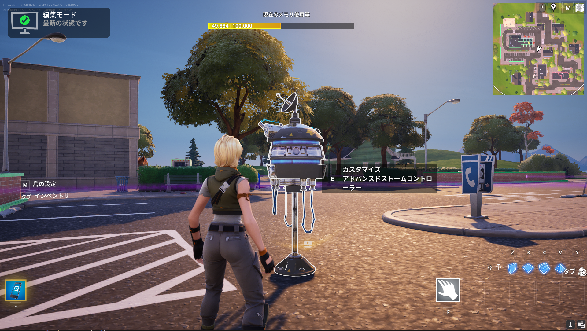
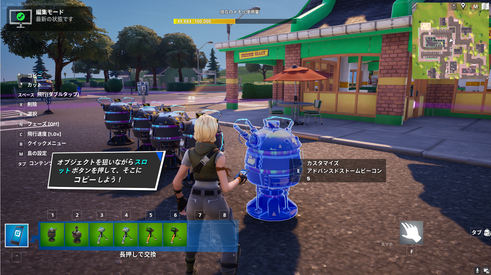
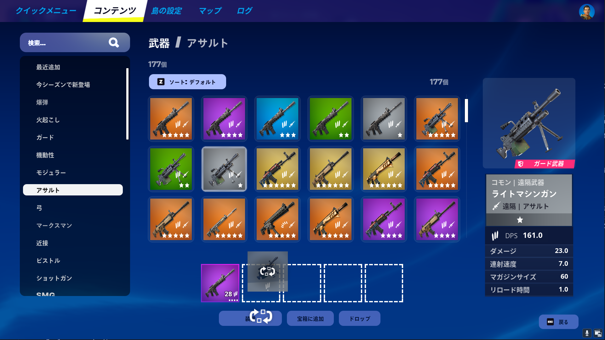

# Fortniteのワールドをゲームにしよう

[株式会社DREAMSQUARE](https://dreamsquare.tech)  黒田 隆史（くろだ たかし）・ 安藤 太亮（あんどう たいすけ）

## 本講義の目標

自作のワールドをバトルロイヤルの舞台にする。

## もくじ

- [Fortniteのワールドをゲームにしよう](#fortniteのワールドをゲームにしよう)
  - [本講義の目標](#本講義の目標)
  - [もくじ](#もくじ)
  - [1. バトルロイヤルとは](#1-バトルロイヤルとは)
  - [2. バトルロイヤルの設定方法](#2-バトルロイヤルの設定方法)
  - [まとめ](#まとめ)

## 1. バトルロイヤルとは

  - ### 1.1. ゲームの種類
  
    以下にFortnite上にあるゲームの種類を９つ紹介します。

    |種類|内容|
    |---|---|
    |バトルロイヤル (Battle Royale)|プレイヤーが最後の1人になるまで戦うサバイバルゲーム。|
    |デスマッチ (Deathmatch)|制限時間内に最も多くのキルを獲得したプレイヤーが勝利するモード。|
    |キャプチャー・ザ・フラッグ (Capture the Flag)|チームが相手チームのフラッグを奪い、自陣に持ち帰るゲーム。|
    |レース (Racing)|プレイヤーがコースを競走して、最速でゴールすることを目指すゲーム。|
    |パズル (Puzzle)|プレイヤーが謎を解き、次のステージに進むゲーム。|
    |サバイバル (Survival)|プレイヤーが波状攻撃してくる敵から生き延びることを目指すゲーム。|
    |エスケープ (Escape)|脱出を目指すアドベンチャー形式のゲーム。|
    |シミュレーション (Simulation)|リアルな体験やシチュエーションをシミュレートしたゲーム。|
    |パーティーゲーム (Party Games)|短時間で楽しめるミニゲームの集合体。|

  - ### 1.2. バトルロイヤルとバトルロワイアルの違い

    本講義では、上で紹介したゲームの種類のうち、バトルロイヤルを作る方法について説明していきます。その前に、皆さんは**バトルロイヤル**のことをどの様に略し呼びますか？多くの人は**バトロワ**と呼ぶのではないでしょうか。この**バトロワ**という言葉は、**バトルロワイアル**から来ています。では、Fortnite上で表記されている**バトルロイヤル**との違いは何でしょうか？実は**バトルロワイアル**というのは小説の名前です。この小説はバトルロイヤルの世界が現実になってしまうというストーリーで、作者の高見広春（たかみこうしゅん）さんが**バトルロイヤル**よりも**バトルロワイアル**の言葉の響きを気に入って、小説の名前にしたことから、日本では**バトルロワイアル**が浸透し、**バトロワ**と略されるようになりました。

  - ### 1.3. バトルロイヤルのゲームの流れ

    そもそもバトルロイヤルは、**最後まで残った1人または1チームが勝者**となります。ここでは、バトルロイヤルのゲームが進行する過程を確認していきましょう。

    - #### 1. ロビーでの待機

        プレイヤーはゲーム開始前にロビーで待機します。

    - #### 2. スポーンとエリア移動

        ゲームがスタートすると、プレイヤーは特定の位置（Fortniteでは空が一般的）にスポーンされます。スポーン後は、高所や建物内など、初期装備を見つけやすい場所や敵と距離を置ける場所を選び移動します。

    - #### 3. 初期装備の収集

        ゲーム開始直後は、プレイヤーは武器やアイテムを持っていないか、最低限の装備しか持っていません。マップ上を散策し、武器、シールド、回復アイテムなどを素早く収集します。
        
    - #### 4. 戦闘と生存

        プレイヤーは、他のプレイヤーと戦いながら生存を目指します。戦闘を挑むか避けるかの判断が重要で、敵を見つけたら、勝てる確信がある場合に戦闘を仕掛け、リスクが高い場合は撤退するなどの戦略が必要です。

    - #### 5. 安全地帯の移動

        ゲームが進むにつれて、マップ上の「安全地帯」が徐々に縮小します。これにより、プレイヤーは安全地帯への移動を強いられます。安全地帯へ向かう際に、他のプレイヤーと遭遇するリスクが高まります。できるだけ早く安全地帯に到達し、ポジションを確保することが勝利への鍵です。
        
    - #### 6. 終盤の戦い

        ゲームが進むと、残りのプレイヤー数が少なくなり、戦場はより狭くなります。最後の数人の戦いでは、建物の利用や地形の把握が重要になります。高所を取る、カバーを利用するなどの戦術が勝敗を分けます。

## 2. バトルロイヤルの設定方法

ここでは、実際に皆さんが作ったワールドをバトルロイヤルの舞台にする設定を６つの項目に分けて説明します。

  - ### 2.1. 島の収縮（安全地帯）を設定

    **仕掛け**から**アドバンスドストームコントローラー**を島の上に設置します。この際、設置された位置を中心にラウンドが収縮するので、できるだけ島の中心に設置してください。設置が完了したら、**アドバンスドストームコントローラー**に近づき**カスタマイズ**を選択して、**フェーズ１の範囲**という設定項目をマップの広さに応じて設定してください。

    

    また、ストームの縮小時間をカスタマイズしたい場合は、**仕掛け**から**アドバンスドストームビーコン**を島の上に設置し、各種設定を変更してください。この**アドバンスドストームビーコン**は時間を設定したいラウンドの数だけ設置する必要があります。

    

  - ### 2.2. ゲーム全般の設定

    **メニュー＞自分の島＞モード** に移動し、以下の設定を変更します。

    |項目|設定|設定内容|
    |---|---|---|
    |規模＞最大プレイヤー数|16|ゲームのチーム数を設定|
    |規模＞チームサイズ|均等に分ける|チームの人数を均等に分ける設定。均等に分けることでソロプレイができるようにする。|
    |スポーン＞スポーン上限|1|途中でキルされるとゲームが終了するようにする設定|
    |ゲーム開始＞ゲーム開始カウントダウン|10秒|ゲーム開始前にカウントダウンを行うように設定|
    |終了条件＞最後まで生き残るとゲーム終了|オン|最後まで生き残った場合も勝利にする設定|
    |勝利条件＞ゲームの勝利条件|最多ラウンドで勝利|ラウンド制覇を勝利条件にする設定|
    |スポーン＞スポーン地点|空|ゲームがスタートする位置を空にする設定|
    |ゲーム終了後＞ゲーム勝者の表示時間|10秒|ゲーム終了後に結果を10秒表示させる設定|

  - ### 2.3. プレイヤーの動作設定

    **メニュー＞自分の島＞プレイヤー** に移動し、以下の設定を変更します。

    |項目|設定|設定内容|
    |---|---|---|
    |移動＞落下ダメージ|オン|高所から落下した際にダメージが加わるように設定|
    |移動＞グライダー再展開|オフ|アイテムなしでプレイヤーが飛行できないように設定|
    |移動＞プレイヤーの飛行|オフ|ゲーム中にプレイヤーが飛行できないように設定|
    |イベントリ＞無限建築素材|オフ|素材を無限に使用できないように設定|
    |イベントリ＞無限予備弾薬|オフ|弾薬を無限に使用できないように設定|
    |装備＞ツルハシをもって開始する|はい|ゲーム開始時にすでにツルハシを持っている状態にする設定|
    |装備＞ツルハシでの破壊|デフォルト|ツルハシで建築物を破壊できるようにする設定|

  - ### 2.4. UI（ゲームの見た目）の設定

    **メニュー＞自分の島＞ユーザーインターフェース** に移動し、以下の設定を変更します。

    |項目|設定|設定内容|
    |---|---|---|
    |HUD＞HUD情報タイプ|スコア|スコアを表示させる設定|
    |マップ＞マップ画面を表示|全体マップ|マップを表示させる設定|

  - ### 2.5. ラウンドの設定

    **仕掛け**から**ラウンド設定**を島の上に設置します。設置した**ラウンド設定**に近づき**カスタマイズ**を選択して以下の項目を設定してください。

    |項目|設定|設定内容|
    |---|---|---|
    |「最後まで生き残れば勝利」を上書きする|オーバーライド|最後まで生き残れば勝利を有効にする設定|
    |最後まで生き残れば勝利|はい|敵が自滅した場合でも勝利になるようにするための設定|

  - ### 2.6. 宝箱の設置

    **メニュー＞クリエイティブ＞武器（アイテム）** に移動し、宝箱に入れる武器（アイテム）を選択します。その後**宝箱に追加**を選択し、**メニュー＞クリエイティブ＞宝箱**に移動して**宝箱を作成**をクリックしてください。一か所に宝箱を設置したら、複製して島全体に均等に設置します。

    

## まとめ

  今回の講義では、自作ワールドをバトルロイヤルの舞台に設定する方法を学びました。講義内ではUEFNというPC版の開発エディタとの掛け合わせで開発を行いましたが、Fortniteのクリエイティブモード単体でも、これまで紹介した基本的な動作はすべて設定することができます。これまで学んだ知識を生かして、自分のアイデアをFortniteでどんどん形にしていってください。そして、皆さんの作ったゲームで大人を驚かせましょう！
